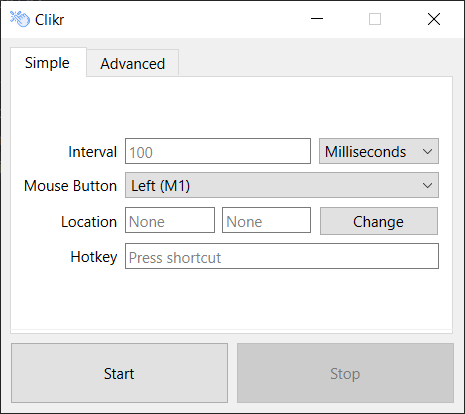
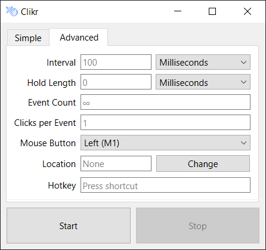

<p align="center">
  
</p>

<div id="toc" align="center">
  <ul style="list-style: none;">
    <summary>
      <h1 align="center">
        Clikr
      </h1>
    </summary>
  </ul>
</div>

<h3 align="center">
  Auto-clicking with a simple GUI
</h3>

<p align="center">
  <a href="https://github.com/CaymanFreeman/Clikr/blob/main/LICENSE.md"></a>&nbsp;
  <a href="https://www.python.org/"></a>&nbsp;
  <a href="https://github.com/CaymanFreeman/Clikr/releases"></a>&nbsp;
  <a href="https://www.linkedin.com/in/caymanfreeman/"></a>
</p>

## Overview

Clikr is a simple auto-clicking application designed to cover most use cases. It is intended for tasks that require a bit more than a basic clicking loop without the need to delve into scripting. Clikr allows you to customize actions such as the interval between clicks, the number of clicks to perform, the duration to hold each click, and more. For a description of each available setting, refer to the [settings](#settings) section.

If you are looking for an in-depth macro system for specific purposes, consider using tools like [AutoHotkey](https://www.autohotkey.com/) instead.

## Download

You can find appropriate downloads for each release [here](https://github.com/CaymanFreeman/Clikr/releases). There is also the option to run the main script, [main.py](https://github.com/CaymanFreeman/Clikr/blob/main/src/main.py), directly from source.

**Windows:** An executable and installer are available to download with each release.

**Linux:** A binary is included in each release.

## Compatibility

Clikr is compatible with both Windows and Linux. Since [pynput](https://pynput.readthedocs.io/en/latest/index.html) is used for input callbacks and controls, Wayland support will be provided under Xwayland with limited functionality as described [here](https://pynput.readthedocs.io/en/latest/limitations.html).

## Executables & Binaries

Each executable/binary simply acts as a bundle for the source files and an interpreter. Each time the file is executed, the source code is expanded to a temporary directory. You can read more about how PyInstaller creates these executables [here](https://pyinstaller.org/en/stable/operating-mode.html#how-the-one-file-program-works).

## Settings

The following are the available settings and what they do. If any input fields are left empty, the default value will be used.

<div display="inline-block">
  
  
</div>

### Interval

##### Default: 100 Milliseconds
The click interval determines the amount of time between clicks. Setting this to 0 will attempt to click as fast as possible, possibly breaking any programs involved in responding to the click process. **Note:** Click interval accuracy begins to diminish with smaller intervals (~100ms to ~22ms depending on the system).

### Mouse Button

##### Default: Left (M1)
The mouse button determines which button on the mouse will be used for each click event.

### Location

##### Default: None
The location determines where each click event will occur. A location can be picked by pressing the "Change" button and clicking the desired location on the screen or by setting the values manually. Pressing Esc while changing the location will cancel the action. If an X or Y location is not specified, the user-controlled mouse position will be used instead. If using a specific X or Y location, a hotkey must be set as well to prevent softlocking.

### Hotkey

The hotkey sequence determines which keys will toggle the click process. To change the hotkey, click into the field and begin typing. Click out of the field to stop editing the sequence or press Esc to clear it. A hotkey must be set if a specific location is provided.

### Hold Length (Advanced)

##### Default: 0
The click length determines how long to hold the click. For example, if the click length is set to 50 milliseconds, the mouse will be pressed down, wait for 50 milliseconds, then release.

### Event Count (Advanced)

##### Default: Infinite
The click events determine how many times to cause a click event. For example, if this is set to 5, the process will conduct 5 different click events then end automatically. If left blank (default), the click process will continue until it is stopped with the hotkey or stop button.

### Clicks Per Event (Advanced)

##### Default: 1
The clicks per event determine how many times to click each time a click event occurs. For example, setting this to 2 will cause each event to be a double click, 3 to be a triple click, etc.

## Bundle Executable or Binary

### Prerequisites

Both recipes assume you have [git](https://git-scm.com/downloads) and [python3](https://www.python.org/downloads) installed.

## Windows

### Clone Repository
```batch
git clone https://github.com/CaymanFreeman/Clikr && cd Clikr
```

### Virtual Environment Setup
```batch
python -m venv .venv
.venv\Scripts\activate.bat
```

### Install Dependencies
```batch
python -m pip install --upgrade pip
pip install -r ./requirements.txt
pip install pyinstaller
```

### Run From Source

From this point, Clikr can be run from the source scripts with `python src\main.py`.

### PyInstaller Bundle
```batch
pyinstaller --noconfirm --onefile --name "Clikr" --windowed --add-data="LICENSE.md:." --icon="assets\icon.ico" --add-data="assets\icon.png:assets" --add-data="assets\window.ui:assets" src\main.py
```

### Run Executable

The executable will be located at `dist\Clikr.exe`.

## Linux

The following packages may need to be installed: 
```
python3-dev python3.12-venv python3-xlib binutils build-essential
```

### Clone Repository
```bash
git clone https://github.com/CaymanFreeman/Clikr && cd Clikr
```

### Virtual Environment Setup
```bash
python3 -m venv .venv
source .venv/bin/activate
```

### Install Dependencies
```bash
python -m pip install --upgrade pip
pip install -r ./requirements.txt
pip install pyinstaller
```

### Run From Source

From this point, Clikr can be run from the source scripts with `python3 src/main.py`.

### PyInstaller Bundle
```bash
pyinstaller --noconfirm --onefile --name "clikr" --add-data="LICENSE.md:." --add-data="assets/window.ui:assets" --hidden-import pynput.keyboard._xorg --hidden-import pynput.mouse._xorg src/main.py
```

### Run Binary

The binary will be located at `dist/clikr`.

‎

hi :)
